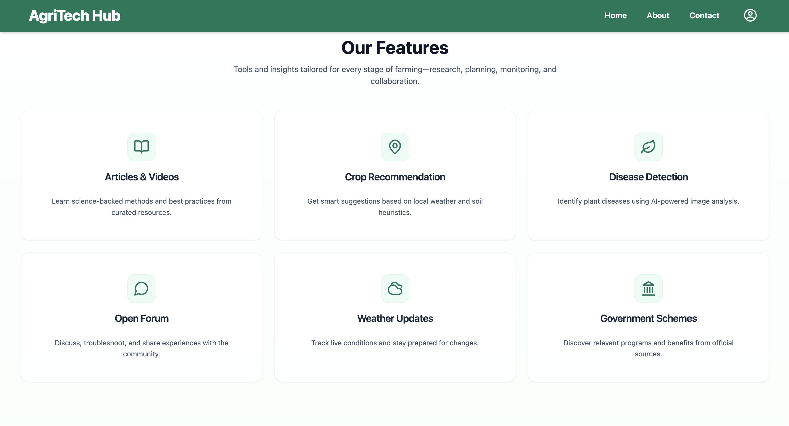
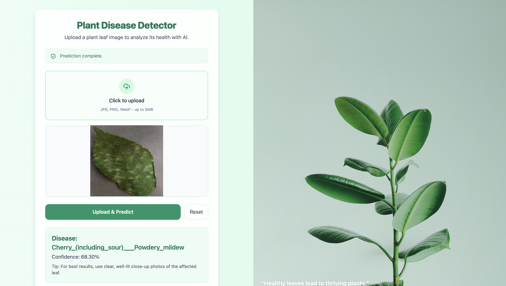
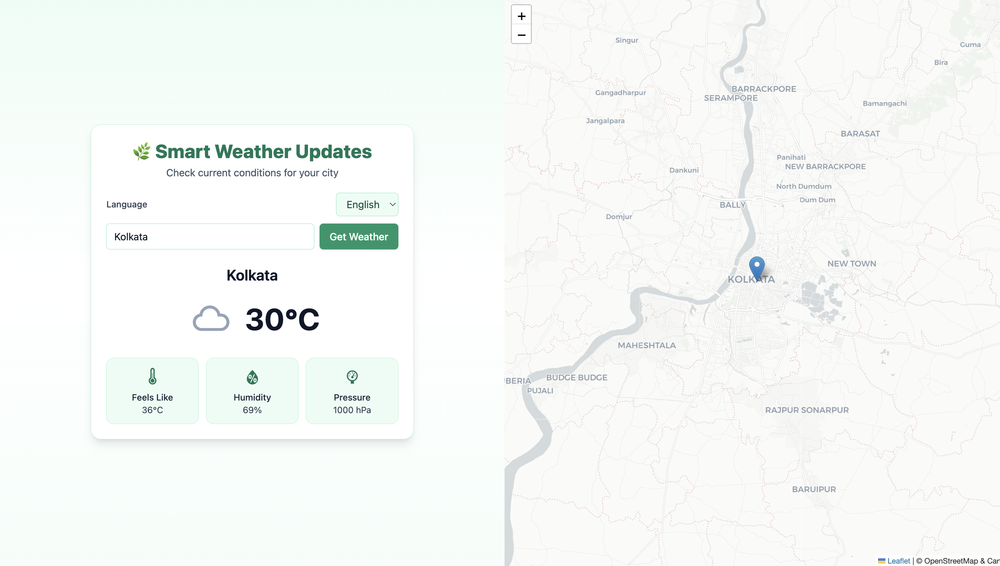

# AgriTech-Hub

## Overview
AgriTech-Hub is an advanced agriculture-based platform designed to empower farmers and agricultural professionals with real-time insights, smart recommendations, and a collaborative knowledge-sharing space. It integrates AI, real-time data, and community-driven insights to optimize farming practices and improve crop productivity.

## Features
- **Interactive Knowledge Hub**:A space for farmers to share knowledge, best practices, and farming techniques.
- **Crop Recommendation System**: Provides crop suggestions based on soil quality, weather conditions, and user preferences.
- **Smart Weather Updates with Map**: Real-time, location-based weather information displayed alongside an interactive map for visual context.
- **Plant Disease Detection**: AI-powered tool to detect plant diseases through image analysis.
- **Localized Language Support**: Available in English, Hindi, and Bengali using React-i18next.
- **Community Forum**: Enables discussions, problem-solving, and idea-sharing among users.
- **Government Schemes & Subsidies**: Provides updated information on agricultural schemes and subsidies.

<h2 id="screenshots">⚙ Screenshots</h2>
<h4>Login Page</h4>

<h4>Home Page</h4>

<h4>Features Page</h4>

<h4>Plant Disease Detector</h4>

<h4>Smart Weather Update</h4>



## Tech Stack
### Frontend
- **Framework**: React (Vite) with Tailwind CSS
- **Routing**: React Router
- **State Management**: Context API  
- **Maps**: React-Leaflet + Leaflet for weather map
- **Localization**: React-i18next
 

### Backend
- **Framework**: Node.js with Express.js
- **Database**: Firebase (Firestore via Admin SDK)
- **APIs Used**:
  - **Soil Data**: SoilGrids API
  - **Weather Updates**: OpenWeather API
  - **Crop Details**: OpenFarm API

### Machine Learning
- **Plant Disease Detection Model**: Custom TensorFlow model (trained on 8 classes, achieving >85% accuracy)
- **Image Processing**: Flask-based backend API for model inference

## Installation
### Prerequisites
- Node.js & npm
- Python (for ML model)
- Firebase project setup  

### Steps
1. **Clone the Repository**
   ```sh
   git clone https://github.com/Dsmita03/AgriTech-Hub
   ```
2. **Install Dependencies**
   ```sh
   # Frontend
   cd frontend
   npm install
   
   # Backend
   cd ../backend
   npm install
   ```
3. **Start the Backend Server**
   ```sh
   cd backend
   node server.js
   ```
4. **Start the Frontend**
   ```sh
   cd frontend
   npm run dev
   ```

## Contributors
[](https://github.com/Dsmita03/AgriTech-Hub/graphs/contributors)

---
## Contributing Rules
Contributions are welcome 😊

- Fork the repo

- Create a feature branch: git checkout -b feat/your-feature

- Commit changes: git commit -m "feat: add your feature"

- Push: git push origin feat/your-feature

- Open a Pull Request

Please follow conventional commits and include screenshots or videos for UI changes.

## 📞 Contact
 Project Maintainer: <b>Debasmita Sarkar
  
 